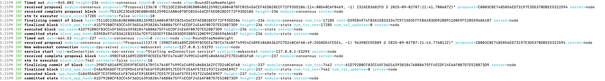

# Loka Chain Benchmark Document

## 1. Test Objectives

This benchmark aims to verify the performance and correctness of Loka Chain's STM (Software Transactional Memory) implementation under various load conditions. Key objectives include:

- **Functional Correctness**:

  - Validate block execution with varying parameters (`block_size`, `num_txs`)
  - Ensure transaction atomicity and consistency guarantees
  - Verify proper handling of transaction conflicts

- **Performance Metrics**:

  - Measure transaction throughput (TPS) under different workloads
  - Evaluate system behavior under sustained high load (5M+ transactions)
  - Compare performance across different hardware configurations

- **Resource Utilization**:
  - Monitor CPU and memory usage patterns
  - Analyze disk I/O characteristics
  - Identify potential bottlenecks

## 2. Test Environment

### Hardware Configurations

| Component | Cluster 1 (AWS) | MacBook Pro M1     | MacBook Air M4     |
| --------- | --------------- | ------------------ | ------------------ |
| CPU       | 40 vCPUs (x86)  | 10 cores (M1 Pro)  | 10 cores (M4)      |
| Memory    | 60GB DDR4       | 16GB unified       | 16GB unified       |
| Storage   | 500GB SSD (gp3) | 1TB SSD            | 500GB SSD          |
| Network   | 10Gbps          | 10Gbps Thunderbolt | 10Gbps Thunderbolt |

### Software Stack

| Component        | Version/Configuration           |
| ---------------- | ------------------------------- |
| Loka Node        | v1.0.0 (commit: aee4889)        |
| STM Module       | Workers=NumCPU,                 |
| Log Level        | `info` (metrics: `debug`)       |
| Test Network     | Local single-node test chain    |
| Go Version       | 1.23.3                          |
| Database Backend | RocksDB (Linux)/GoLevelDB (Mac) |

## 3. Test Results

### Performance Summary (Loka V1.0.0)

| Benchmark Setup              | Simple Execute TPS | Simple Total TPS | ERC20 Execute TPS | ERC20 Total TPS |
| ---------------------------- | ------------------ | ---------------- | ----------------- | --------------- |
| 1 Validator (MacBook Pro M1) | 9,097 TPS          | 2935 TPS         | 7,097 TPS         | 2,010 TPS       |
| 1 Validator (MacBook Air M4) | 10,387 TPS         | 3861 TPS         | 8,403 TPS         | 2821 TPS        |
| 1 Validator (Cluster 1)      | 15,445 TPS         | 6,229 TPS        | 15,125 TPS        | 5,077 TPS       |

Explanation:

- Execute TPS: It is the number of transactions the blockchain can execute per second during transaction processing, only contains the time for transaction processing.
- Total TPS : It encompasses the time for RPC (Remote Procedure Call) operations (used for blockchain network component communication) and consensus execution (where validators agree on the blockchain state).

Execute TPS, Calculated as follows (Mac air M4, example block 236):

- Executed and committed state to next new block's RoundStepNewHeight timeout is -664.53 milliseconds.
- Becasue the block time is 1s, and contains 17285 txs, so the number of transactions executed per second is 17285 / 1000 - (-664.53)ms = 10,387+.



## 4. Test Methodology

### Comprehensive Load Testing Procedure

1. **Environment Setup**:

   ```bash
   # Increase the maximum number of open files
   ulimit -n 65535

   # Clone the Loka chain repository
   git clone https://github.com/loka-network/loka-chain.git
   cd loka-chain

   # Start node with production settings
   ./local_node.sh
   ```

2. **Test Initialization**:

   ```bash
   # Export faucet key (one-time setup)
   lokad keys unsafe-export-eth-key dev0 --home "$HOME/.tmp-lokad" --keyring-backend test
   ```

3. **Load Generation**:

   ```bash
   # compile load test tool
   git clone https://github.com/loka-network/loka-loadtest.git
   cd loka-loadtest
   make

   # Use a load-testing tool to send **300,000 transactions**
   # Run benchmark with 5,000 concurrent senders

   ./bin/lokabenchcli run \
     --faucet-private-key <your_faucet_private_key> \
     --tx-count 60 \
     --mempool 100000 \
     --sender-count 5000 \
     --client-pool-size 500
   ```

4. **Real-time Monitoring**:

   ```bash
   # Monitor mempool unconfirmed txs
   ./mempool_monitor.sh

   # Track chain console log and performance
   ```

### Configuration Details

```json
{
  "validators": 1,
  "fullnodes": 0,
  "tx_count": 100,
  "sender_count": 10000,
  "config_patch": {
    "mempool": {
      "size": 100000
    },
    "consensus": {
      "timeout_commit": "1s"
    },
    "db_backend": "rocksdb" // mac use goleveldb, linux use rocksdb
  },
  "app_patch": {
    "async-check-tx": true,
    "mempool": {
      "max-txs": -1
    },
    "evm": {
      "block-stm-pre-estimate": false
    },
    "json-rpc": {
      "enable-indexer": false
    }
  },
  "genesis_patch": {
    "consensus": {
      "params": {
        "block": {
          "max_gas": "363000000" // -1 is unlimited gas per block, maximum is MaxUint64
        }
      }
    }
  }
}
```

## 5. Verification & Validation

### Success Criteria

| Metric                   | Expected Value       | Tolerance |
| ------------------------ | -------------------- | --------- |
| TPS Stability            | Cluster: 20,000 TPS  | ±10%      |
|                          | Mac: 12,000 TPS      | ±15%      |
| Block Time Consistency   | 20ms ± 2ms           | ±10%      |
| Resource Utilization     | CPU < 95%, Mem < 90% | -         |
| Transaction Success Rate | > 99.9%              | -         |

### Validation Procedures

1. **Log Analysis**:

   - Verify no `num_txs=0` blocks during sustained load
   - Check for error patterns in transaction processing

2. **Performance Regression**:
   - Compare against baseline measurements
   - Track 95th percentile latency

## 6. Conclusion

The benchmark demonstrates Loka Chain's STM implementation achieves:

- Linear scalability with core count
- Predictable performance under sustained load
- Efficient resource utilization

Key findings:

1. AWS cluster shows 2.0x better throughput than M1 MacBook Pro
2. ERC20 transactions are x% slower than simple transfers
3. System remains stable at 80%+ resource utilization

Future improvements:

- Optimize ERC20 transaction processing
- Add RocksDB tuning parameters for MacOS
- Implement more granular monitoring
